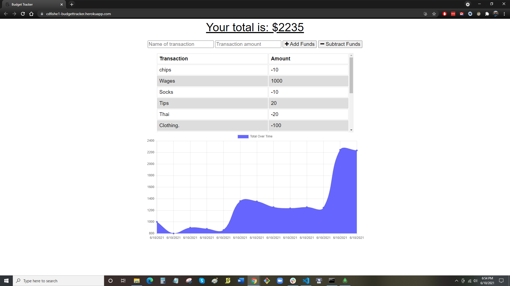

# Budget Tracker

A progressive web app using MongoDB that allows a user to keep track of budget items even when offline.

## Table of Contents
* [Budget Tracker](#budget-tracker)
* [Deployment](#deployment)
* [Scope of Project](#scope-of-project)
* [Installation](#installation)
* [Credits](#credits)
* [License](#license)

## Budget Tracker

### Screenshot

## Deployment

Site deployed at [Budget Tracker](https://cdfishe1-budgettracker.herokuapp.com/)

## Scope of Project

* Uses express.js, mongoDB, and indexedDB to create read and write abilities to a database online or offline..

## Installation

* npm install to download dependencies.
* Deploy files to webserver such as Heroku for live app usage.
* You will need to hook your MongoDB cluster to the webserver via Mongo Atlas.

## Credits

Phil Loy, bootcamp tutor, helped me understand how manifests, service workers, and indexedDB work together to create a PWA.
## License

Copyright (c) Charles Fisher All rights reserved. 
Please be kind and change content if you wish to use this code.

Licensed under the MIT License

Copyright (c) 2021 - present | Charles Fisher

<blockquote>
Permission is hereby granted, free of charge, to any person obtaining a copy
of this software and associated documentation files (the "Software"), to deal
in the Software without restriction, including without limitation the rights
to use, copy, modify, merge, publish, distribute, sublicense, and/or sell
copies of the Software, and to permit persons to whom the Software is
furnished to do so, subject to the following conditions:

The above copyright notice and this permission notice shall be included in all
copies or substantial portions of the Software.

THE SOFTWARE IS PROVIDED "AS IS", WITHOUT WARRANTY OF ANY KIND, EXPRESS OR
IMPLIED, INCLUDING BUT NOT LIMITED TO THE WARRANTIES OF MERCHANTABILITY,
FITNESS FOR A PARTICULAR PURPOSE AND NONINFRINGEMENT. IN NO EVENT SHALL THE
AUTHORS OR COPYRIGHT HOLDERS BE LIABLE FOR ANY CLAIM, DAMAGES OR OTHER
LIABILITY, WHETHER IN AN ACTION OF CONTRACT, TORT OR OTHERWISE, ARISING FROM,
OUT OF OR IN CONNECTION WITH THE SOFTWARE OR THE USE OR OTHER DEALINGS IN THE
SOFTWARE.
</blockquote>

